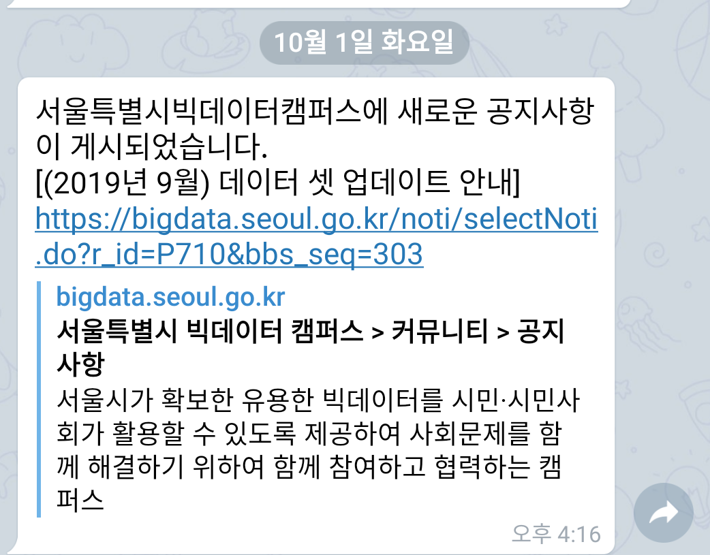
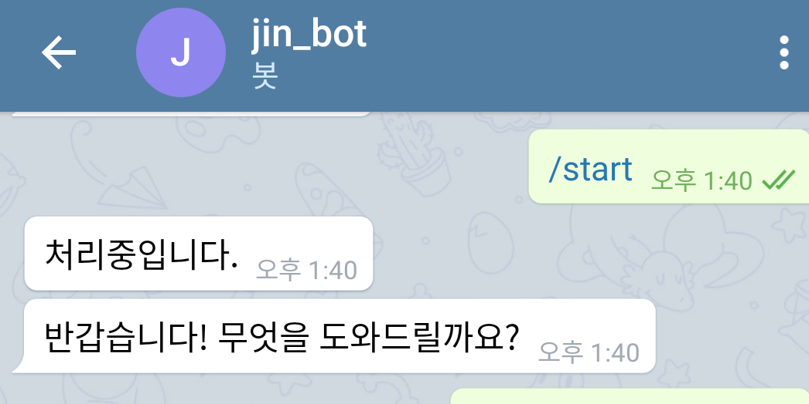
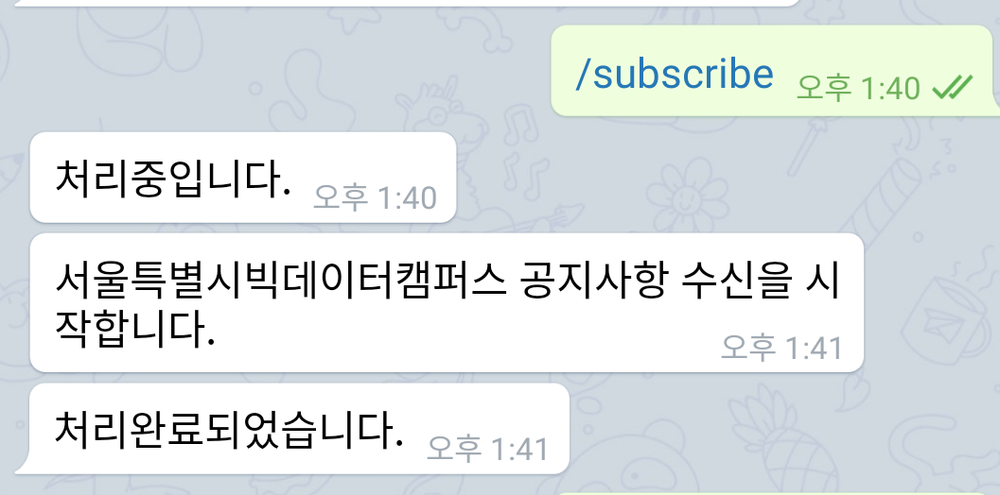
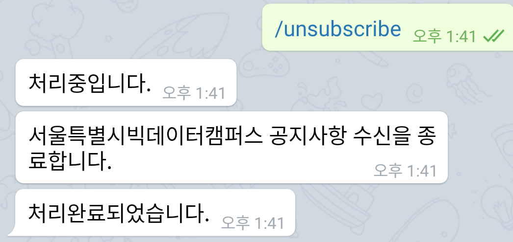
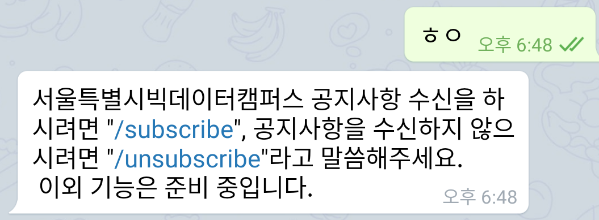
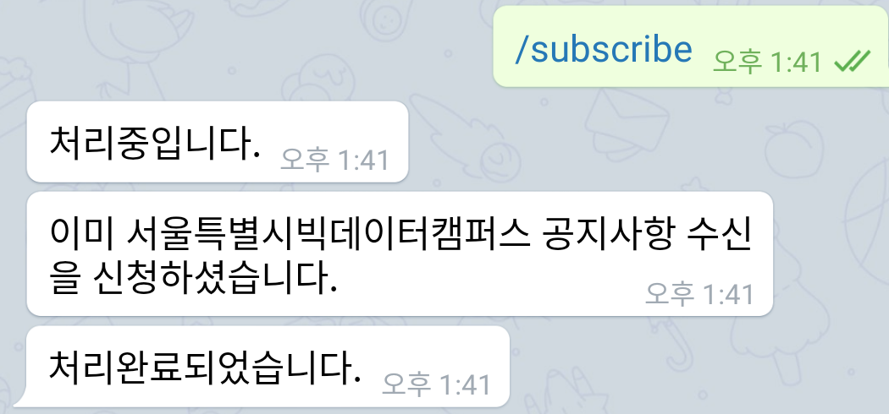

# 공지사항 전달 챗봇

## 개요
- 대상 웹사이트: 서울특별시 빅데이터 캠퍼스 공지사항 (https://bigdata.seoul.go.kr/)
- 전달 경로: Telegram
- 전달 대상: 특정 사용자
  - Telegram으로 구독 신청한 사람에게만 선택적으로 메시지를 발송함.
  - DB를 활용하여 구독 신청 유저를 관리함.
- 새로운 게시물 알림  
새로운 게시물 안내 / 게시물 제목 / 게시물 url
    
- 기타 
  - Thread 활용하여 수신, 발신 기능을 병행함.

## 사용 예시
- **/start** : 채팅 시작 및 DB 등록 
      
- **/subscribe** : 구독신청 커맨드
      
- **/unsubscribe** : 구독해제 커맨드
      
- 등록되지 않은 커맨드 사용시 예외처리
    
- 이미 등록된 이용자 상태 입력시 예외처리
    